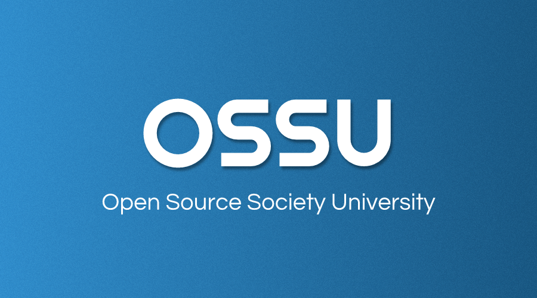

  <strong>Personal journey throguh self-taught education in Computer Science through OSSU curriculum.</strong>

  

# Introduction

The OSSU curriculum is a complete education in computer science using online materials. It's for those who want a proper, well-rounded grounding in concepts fundamental to all computing disciplines. It is designed according to the degree requirements of undergraduate computer science majors, minus general education (non-CS) requirements. The courses themselves are among the very best in the world, often coming from Harvard, Princeton, MIT, etc...

# Curriculum 

- [Core CS](#core-cs)
  - [Core programming](#core-programming)
  - [Core math](#core-math)
  - [CS Tools](#cs-tools)
  - [Core systems](#core-systems)
  - [Core theory](#core-theory)
  - [Core applications](#core-applications)
  - [Core security](#core-security)
- [Advanced CS](#advanced-cs)
  - [Advanced programming](#advanced-programming)
  - [Advanced systems](#advanced-systems)
  - [Advanced theory](#advanced-theory)
  - [Advanced math](#advanced-math)
- [Final project](#final-project)

## Core CS

### Core programming
**Topics covered**:
`functional programming`
`design for testing`
`program requirements`
`common design patterns`
`unit testing`
`object-oriented design`
`static typing`
`dynamic typing`
`ML-family languages (via Standard ML)`
`Lisp-family languages (via Racket)`
`Ruby`
`and more`

The How to Code courses are based on the textbook [How to Design Programs](https://htdp.org/2003-09-26/). The First Edition is available for free online and includes problem sets and solutions. Students are encouraged to do these assignments.

Courses | Notes
:-- | :--: 
[How to Code - Simple Data](https://www.edx.org/course/how-to-code-simple-data) | [Notes](./01-core-programming/01-htc-simple-data/readme.md)

**NOTE:** The rest of the courses will be added as I go through them